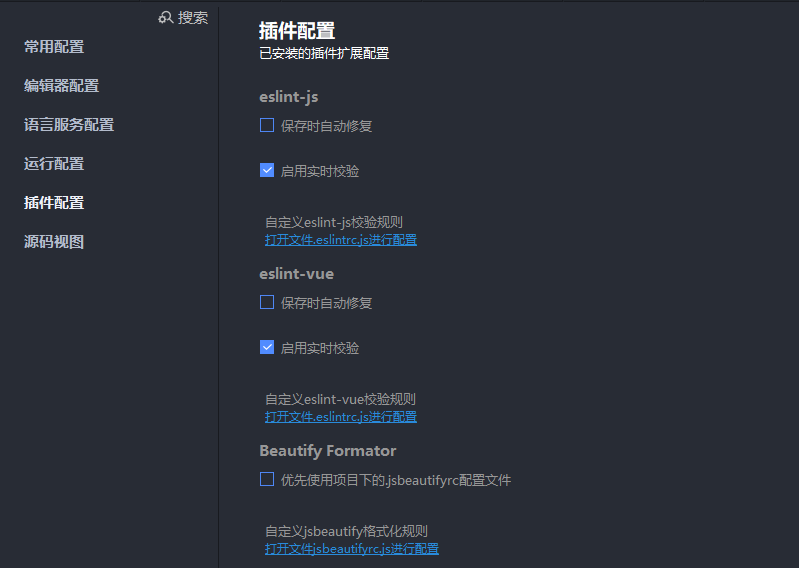
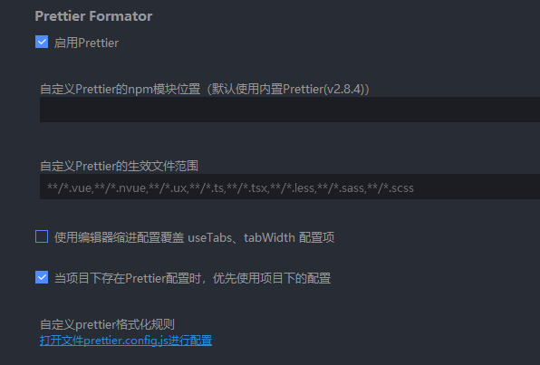
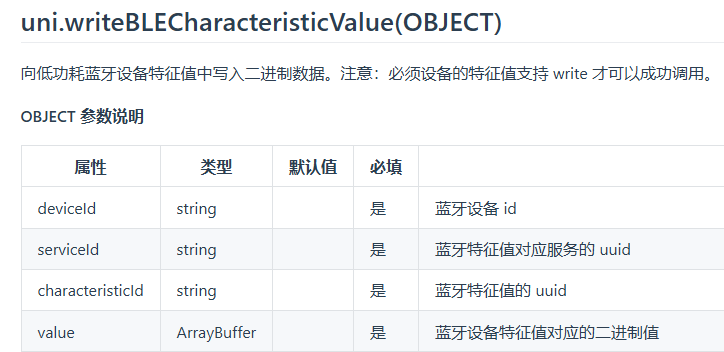

# 代码风格
1. 安装 `eslint-vue eslint-js prettier` 三个插件
2. 工具 - 设置 - 插件配置，关闭HBuilderX自带的 Beautify 格式化插件。其他的按图中的勾选操作。图2自定义生效文件范围后面手动添加 `,**/*.js`，否则不会对js文件进行格式化。
[]()
[]()
3. 工具 - 设置 - 编辑器配置，勾选保存时自动格式化代码。
4. 创建配置文件`.eslintrc.js` `.eslintignore` `.prettierrc` `.prettierignore`
5. https://hx.dcloud.net.cn/Tutorial/extension/eslint-js
6. https://zh-hans.eslint.org/

- 拖尾逗号 `comma-dangle` 是用还是不用？ https://eslint.cn/docs/rules/comma-dangle

# 小程序 webview 通信
https://developers.weixin.qq.com/miniprogram/dev/component/web-view.html

## webview给小程序传数据
- H5发送 `postMessage`
```
// <script type="text/javascript" src="https://res.wx.qq.com/open/js/jweixin-1.6.0.js"></script>

// javascript
wx.miniProgram.navigateTo({url: '/path/to/page'})
wx.miniProgram.postMessage({ data: 'foo' })
wx.miniProgram.postMessage({ data: {foo: 'bar'} })
wx.miniProgram.getEnv(function(res) { console.log(res.miniprogram) })

```

- 小程序接收 `postMessage` 的数据
```
// uniapp 绑定事件是 @message，原生是 bindmessage
<web-view :webview-styles="webviewStyles" :src="webURL" @message="handleMessage" :update-title="false"></web-view>

  methods: {
    handleMessage(e) {
      console.log('----------11')
      console.log(e)
    },
  },
```

 小程序并不是实时接收到数据(这点很坑)，只能在特定时机才能收到数据（小程序后退、组件销毁、分享、复制链接）

```
 H5刷新本页：wx.miniProgram.redirectTo({url: '...'}) // 重新载入本页，难点是记录当前H5页面栈及数据
 H5回退页面：wx.miniProgram.navigateBack // 需要在webview小程序页面之前还有一两个小程序页面才能返回使用
 右上角三个点 - 复制链接、分享时 也能触发bindmessage接收到消息
```

官方没有对通信做过多支持，上述情景只是考虑到分享等特殊情况。

如果是跳出webview页面，去到原生小程序页面，此时可以在路径后加参数传值，在小程序`onLoad`中取值，这样是实时响应的效果，但无法传递大量数据：

```
      wx.miniProgram.navigateTo({
        // url: '/pages/login/login?token=123',
        url: '/pages/login/login',
      })
```

如果想实时响应，点击按钮等操作场景，可能就需要socket了。

## 小程序给H5传数据

```
<web-view src="https://...?token=xxx&uid=xxx"></web-view>
```

H5获取页面路径拿到参数。

# 蓝牙打印

- 在写入操作之前需要根据 `deviceId` 获取服务，再根据服务 `Service` 获取特征值 `Characteristic`，特征值的 properties 中包含了 read、write、notify、indicate 四个属性，其中 read 和 write 表示该特征值是否支持读和写操作。

[]()


## 打印后中文乱码问题，需要转编码成 `GBK`
- 项目用的这个： https://github.com/cnwhy/GBK.js/tree/master
- 其他参考：https://github.com/GitOfZGT/wx-bluetooth-print-demo
https://github.com/inexorabletash/text-encoding/tree/master
- 编码对照表： https://www.cnblogs.com/feichengwulai/articles/3653368.html
https://www.toolhelper.cn/Encoding/GBK

